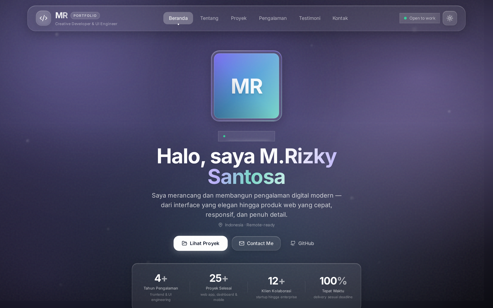
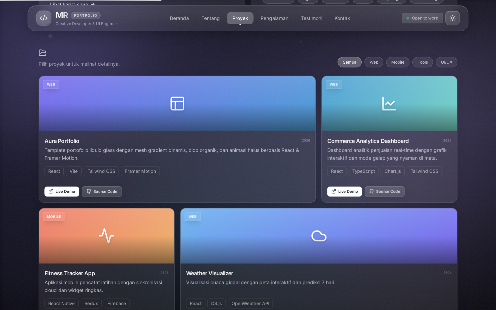
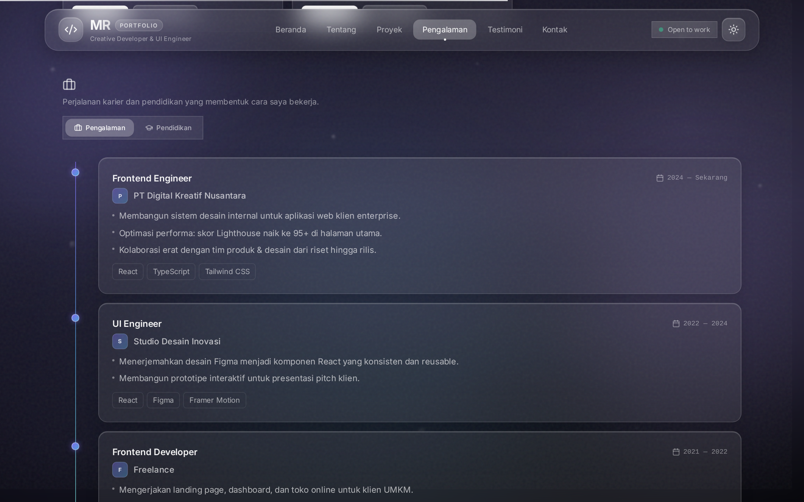
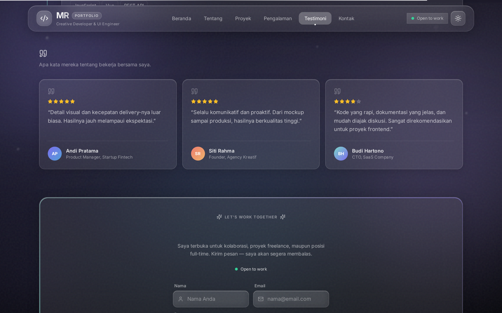
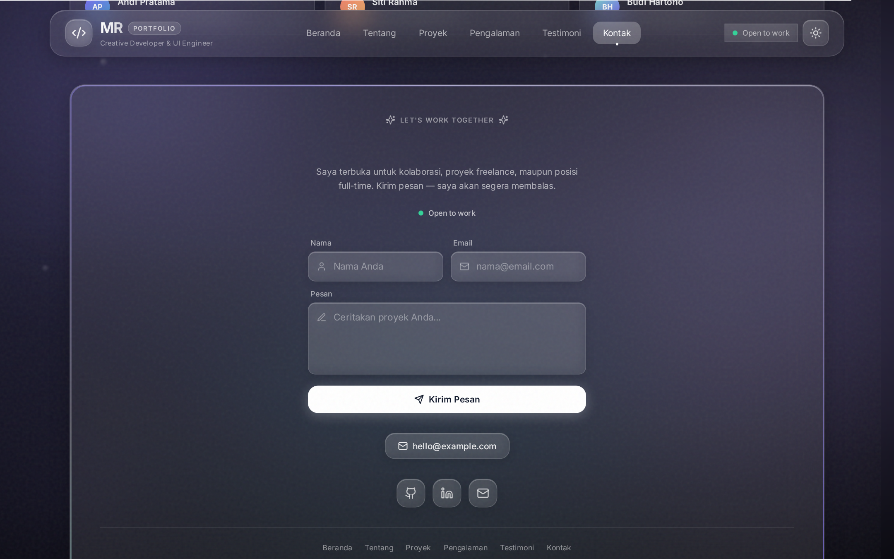
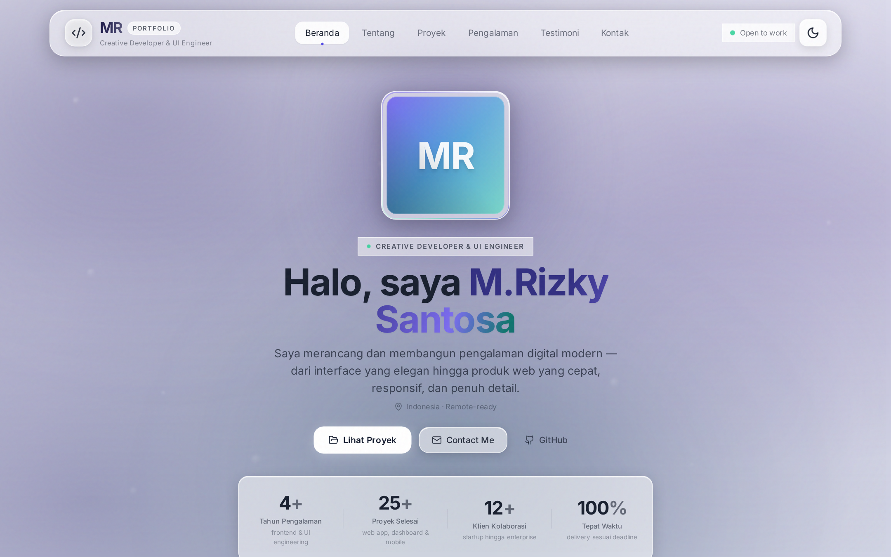

# 💧 Aura — Portofolio Modern & Interaktif

**Aura** adalah template website portofolio modern dengan estetika **Liquid Glass** (glassmorphism): mesh gradient pastel dinamis, tiga blob cair organik yang bergerak perlahan, grid proyek ala **Bento**, modal detail proyek, dan animasi halus berbasis Framer Motion.

Dibangun dengan React, Vite, dan Tailwind CSS — responsif mobile-first dan mudah dikustomisasi melalui satu file data terpusat.

---

## 📸 Preview

### Mode Gelap — Hero


### Mode Gelap — Featured Projects


### Mode Gelap — Pengalaman & Pendidikan


### Mode Gelap — Testimoni Klien


### Mode Gelap — Kontak


### Mode Terang — Hero


---

## ✨ Fitur

- **Dark/Light Toggle**:
  - Tombol toggle di header untuk berpindah mode terang/gelap, tersimpan di `localStorage`.
  - Mengikuti preferensi sistem `prefers-color-scheme` saat pertama kali dibuka.
  - Tanpa flash (FOUC) — tema di-set sebelum halaman dirender.
  - Estetika liquid glass tetap terjaga di kedua mode.

- **Liquid Glass Aesthetic**:
  - Panel kaca frosted (`backdrop-blur`, `bg-white/10`, `border-white/20`, specular glow lembut).
  - Background ambient mesh gradient dengan tiga blob organik yang bergerak lambat.
  - Tipografi Inter dengan animasi halus — tanpa neon, grid cyberpunk, atau font monospace.

- **Hero Section**:
  - Avatar dengan glow radial dan sheen kaca, nama, role, tagline, serta CTA (Lihat Proyek / Contact Me / GitHub / Download CV).
  - Avatar mendukung **foto asli** (isi `avatarImage` di data) — fallback ke inisial jika kosong.
  - Statistik dengan label spesifik + konteks singkat, animasi count-up saat masuk viewport.

- **About Me & Skills**:
  - Kartu biografi singkat (data-driven dari `profile.about`) + tombol **Download CV** (jika `cvUrl` diisi).
  - Skills & Tech Stack dalam pill-pill kaca yang dikelompokkan per kategori.

- **Featured Projects (Bento Grid)**:
  - Grid proyek ala bento dengan filter kategori interaktif.
  - Kartu mendukung **screenshot/mockup asli** (isi `image` per proyek) — fallback ke gradient + ikon jika kosong.
  - Tombol **Live Demo** dan **Source Code** selalu terlihat di setiap kartu (tanpa perlu hover).
  - Klik kartu membuka **slide-over modal detail** (deskripsi, tech stack, tautan).

- **Experience & Education Timeline**:
  - Section timeline dengan **tab toggle Pengalaman/Pendidikan** (data dari `experience` & `education`).
  - Garis timeline gradient ungu–biru, dot gradient, periode, dan tech stack per posisi.

- **Testimonials**:
  - Grid kartu testimoni klien dengan avatar inisial, kutipan, dan **rating bintang opsional** (data dari `testimonials`; hapus field `rating` jika tidak ada data).

- **Contact Section**:
  - **Form kontak** (nama, email, pesan) yang mengirim lewat `mailto:`.
  - Status ketersediaan dengan **indikator titik hijau** (`profile.availability`).
  - Tombol kontak langsung: email dan **WhatsApp** (muncul jika `profile.whatsapp` diisi).
  - Ikon sosial (GitHub, LinkedIn, Email), copyright, dan navigasi kembali ke atas.

- **Responsive & Mobile-First**:
  - Layout presisi di layar HP hingga desktop; navigasi berubah menjadi menu hamburger di layar kecil.

- **Screenshot Preview**:
  - Jalankan `npm run screenshot` (butuh dev server aktif di `localhost:5173`) untuk mengambil ulang gambar preview di `screenshots/` menggunakan Playwright.

- **Animasi Lanjutan**:
  - **Scroll progress bar** tipis bergaya glass di bagian atas halaman.
  - **Cursor spotlight** — glow pastel yang mengikuti mouse (otomatis tersembunyi di perangkat sentuh).
  - **Parallax background** — blob liquid bergerak dengan kecepatan berbeda saat scroll.
  - **3D tilt** pada kartu proyek yang mengikuti posisi mouse.
  - **Count-up stats** di hero dengan animasi angka.
  - **Tech stack marquee** — strip teknologi berjalan tak berujung (pause saat hover).
  - **Scroll-spy nav** — link navigasi tersorot mengikuti section yang sedang dilihat.
  - **Entrance & reveal stagger** — hero, kartu, dan skill pills muncul berurutan.
  - **Rotating role text** — role di hero berganti kata setiap 2,8 detik dengan slide + blur.
  - **Aurora border** — cincin conic-gradient berputar mengelilingi avatar, panel kontak, dan modal.
  - **Spotlight sheen** — kilau radial yang mengikuti kursor di dalam kartu proyek, About, dan panel kontak.
  - **Magnetic buttons** — tombol CTA tertarik halus ke arah kursor (spring).
  - **Floating glass particles** — partikel kaca melayang pelan di latar belakang.
  - **Film grain** — tekstur noise halus bergerak di atas halaman untuk kesan premium.
  - **Word-reveal headings** — judul section muncul kata-per-kata dengan blur + slide-up.
  - Menghormati preferensi `prefers-reduced-motion` pengguna.

---

## 🛠️ Tech Stack

| Komponen | Teknologi |
| :--- | :--- |
| **Framework** | [React 18](https://react.dev/) + [Vite](https://vitejs.dev/) |
| **Styling** | [Tailwind CSS](https://tailwindcss.com/) (Glassmorphism & Custom Keyframe Blobs) |
| **Motion & Animasi** | [Framer Motion](https://www.framer.com/motion/) |
| **Ikon** | [Lucide React](https://lucide.dev/) |

---

## 📁 Struktur Proyek

```
├── src/
│   ├── components/
│   │   ├── Header.jsx             # Navigasi kaca sticky (desktop & hamburger mobile)
│   │   ├── LiquidBackground.jsx   # Pastel mesh gradient & 3 liquid blob
│   │   ├── Hero.jsx               # Hero: avatar, nama, role, CTA, statistik
│   │   ├── About.jsx              # Tentang Saya + Skills & Tech Stack
│   │   ├── Projects.jsx           # Bento grid showcase + filter kategori
│   │   ├── Experience.jsx         # Timeline pengalaman kerja
│   │   ├── Testimonials.jsx       # Testimoni klien
│   │   ├── ProjectModal.jsx       # Slide-over detail proyek
│   │   └── ContactSection.jsx     # Kontak, sosial, dan footer
│   ├── data/
│   │   └── portfolio.js           # ⭐ Semua konten: profil, skills, proyek, sosial
│   ├── App.jsx                    # Root komponen
│   ├── index.css                  # Tailwind & glass utility classes
│   └── main.jsx                   # React entry point
├── index.html                     # Template HTML dengan font Inter
├── package.json
├── tailwind.config.js             # Tailwind config & keyframes blob
└── vite.config.js                 # Vite config
```

---

## ✏️ Cara Mengubah Identitas (Data Portofolio)

Semua konten — identitas, proyek, pengalaman, testimoni — diatur dari **satu file**:

```
src/data/portfolio.js
```

Cukup ubah nilainya, tampilan dan layout otomatis menyesuaikan. Berikut referensi lengkap setiap variabel:

### 👤 `profile` — Identitas Utama

| Field | Fungsi | Contoh / Catatan |
| :--- | :--- | :--- |
| `name` | Nama lengkap | `'M.Rizky Santosa'` |
| `initials` | Inisial (avatar fallback + brand) | `'MR'` |
| `role` | Posisi di header | `'Creative Developer & UI Engineer'` |
| `roles` | Role yang berputar di hero (array) | `['Frontend Engineer', 'UI/UX Enthusiast']` |
| `tagline` | Deskripsi singkat di hero | Satu kalimat maks. |
| `location` | Lokasi & ketersediaan remote | `'Indonesia · Remote-ready'` |
| `email` | Email utama (kontak & form) | `'hello@example.com'` |
| `whatsapp` | Nomor WhatsApp (format internasional tanpa `+`) | `'628123456789'` — **kosongkan (`''`) untuk menyembunyikan tombol WhatsApp** |
| `availability` | Status ketersediaan (titik hijau) | `'Open to work'` |
| `avatarGradient` | Warna gradient avatar fallback | CSS `linear-gradient(...)` |
| `avatarImage` | Foto asli avatar | `'/avatar.jpg'` atau URL — **kosongkan untuk memakai inisial** |
| `cvUrl` | Tautan file CV | `'/cv.pdf'` — **kosongkan untuk menyembunyikan tombol Download CV** |
| `about` | Paragraf section "Tentang Saya" (array) | Tiap elemen jadi satu paragraf |

### 📊 `stats` — Statistik Hero

Tiap item: `value` (angka), `suffix` (mis. `'+'` / `'%'`), `label` (judul), `note` (konteks singkat).

```js
{ value: 4, suffix: '+', label: 'Tahun Pengalaman', note: 'frontend & UI engineering' }
```

### 🔗 `socials` — Tautan Sosial

Tiap item: `label`, `href`, `icon` (`'github'`, `'linkedin'`, `'mail'`).

```js
{ label: 'GitHub', href: 'https://github.com/username', icon: 'github' }
```

### 🛠️ `skills` — Tech Stack

Dikelompokkan per kategori: `category` + `items` (array). Muncul di marquee & kartu About.

```js
{ category: 'Frontend', items: ['React', 'TypeScript'] }
```

### 🗂️ `projects` — Kartu Proyek

| Field | Fungsi |
| :--- | :--- |
| `id` | Identitas unik (untuk key React) |
| `title` | Judul proyek |
| `category` | Kategori untuk filter — **dibuat otomatis dari semua kategori yang ada** |
| `description` | 1–2 kalimat inti (dibatasi 2 baris) |
| `longDescription` | Deskripsi lengkap di modal detail |
| `tech` | Tech stack (array) |
| `gradient` | Warna fallback thumbnail |
| `icon` | Ikon fallback: `'layout'`, `'chart'`, `'activity'`, `'cloud'`, `'coins'`, `'swatch'` |
| `image` | Screenshot/mockup asli — **kosongkan untuk memakai gradient + ikon** |
| `liveUrl` | Tautan demo — `'#'` jika belum ada |
| `githubUrl` | Tautan source code |
| `year` | Tahun pengerjaan |

### 💼 `experience` & 🎓 `education` — Timeline

Tiap item pengalaman: `role`, `company`, `period`, `highlights`, `tech`.
Tiap item pendidikan: `degree`, `school`, `period`, `highlights`, `tech`.
`highlights` adalah array 2–3 poin singkat (jauh lebih enak dibaca daripada satu paragraf panjang; `description` lama tetap didukung sebagai fallback).
`logo` opsional — isi path/URL logo perusahaan (mis. `'/companies/acme.png'`); kosongkan untuk memakai kotak inisial otomatis.
Kedua array tampil di section yang sama lewat tab **Pengalaman / Pendidikan**.

### 💬 `testimonials` — Testimoni

Tiap item: `quote`, `name`, `role`, `initials`, `gradient`, `rating` (1–5).
Usahakan `quote` maksimal 25–30 kata agar kartu tetap ringkas.
Field `rating` **opsional** — hapus/kosongkan jika tidak punya datanya, bintang tidak akan tampil.

### 🎨 `defaultPalette` — Warna Aksen

`primary`, `secondary`, `tertiary`, `glow`, `rawHex` — warna blob & glow background. Ubah jika ingin mengganti nuansa warna keseluruhan.

---

> **Tips:** field opsional yang dikosongkan (`avatarImage`, `cvUrl`, `whatsapp`, `image` proyek, `rating` testimoni) otomatis menyembunyikan elemen terkait — tidak perlu mengubah kode komponen.

---

## 🚀 Menjalankan

```bash
npm install
npm run dev
```

Buka `http://localhost:5173`.

Build produksi:

```bash
npm run build
npm run preview
```

---

## 📄 Lisensi

MIT.